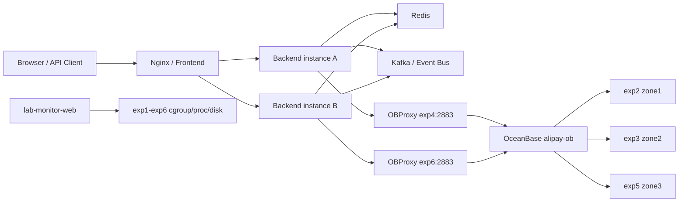

# mybank 仿支付宝分布式实验系统技术方案

> 面向实施 AI 的交接文档。本文以当前 `mybank` 仓库和 6 台 webide 实验容器为基线，目标是让另一个 AI 可以按阶段直接开始编码、部署、测试和复盘。  
> 日期：2026-05-26  
> 仓库：`git@github.com:kalingod/mybank.git`

---

## 1. 项目目标

### 1.1 业务目标

建设一个仿支付宝的交易型 Demo 系统，重点不在 UI 花哨，而在完整覆盖金融交易系统的核心工程问题：

- 用户账户与余额管理。
- 转账交易。
- 红包创建、抢红包、退款/过期。
- 账单流水查询。
- 幂等、防重、并发一致性。
- OceanBase 三副本高可用、OBProxy 路由、故障恢复。
- 中间件、监控、压测、运维恢复。

### 1.2 学习目标

该系统是分布式系统实验平台，不只是 CRUD Demo。实施时要刻意保留并验证这些主题：

- OceanBase MySQL 模式下的事务、行锁、唯一约束和主备切换。
- DB 强一致事务与 Redis/Kafka 等中间件的边界。
- 幂等键、业务流水号、事务 outbox、最终一致消息。
- 多实例后端部署、应用无状态化、灰度和回滚。
- 容器内 cgroup 资源口径、监控页面、压测结果解释。
- 容器重建后的恢复脚本和基础设施即代码。

### 1.3 非目标

第一阶段不追求真实支付牌照级能力：

- 不接入真实银行卡/支付渠道。
- 不做真实实名认证、风控画像、反洗钱。
- 不承诺生产级安全审计。
- 不做复杂微服务拆分优先，先用模块化单体跑通交易闭环，再演进为多服务。

---

## 2. 当前已完成基线

### 2.1 Git 与工作区

| 项目 | 值 |
|---|---|
| GitHub | `git@github.com:kalingod/mybank.git` |
| Mac 工作区 | `/Users/didi/Desktop/project/personal/mybank` |
| 内网 bare repo | `/home/workspace/git/mybank.git` |
| 实验机共享工作区 | `/home/workspace/mybank` |
| Mac remote | `origin`, `internal` |

典型同步：

```bash
git push origin main
git push internal main
ssh exp2 'cd /home/workspace/mybank && git pull internal main --ff-only'
```

### 2.2 实验机拓扑

| 节点 | IP | 当前角色 | 磁盘基线 | 说明 |
|---|---:|---|---|---|
| exp1 | 10.190.40.174 | spare / 前端候选 | 60G overlay | 可放 Nginx/前端/网关 |
| exp2 | 10.190.0.81 | OBD 控制机 / OBServer zone1 | 300G overlay | OceanBase 控制与压测客户端 |
| exp3 | 10.190.5.111 | OBServer zone2 | 300G overlay | OceanBase 三副本节点 |
| exp4 | 10.190.49.117 | OBProxy | 300G overlay | 可兼任后端实例 A |
| exp5 | 10.190.5.65 | OBServer zone3 | 100G overlay | 最小盘，重点监控 |
| exp6 | 10.190.14.135 | OBProxy | 300G overlay | 可兼任后端实例 B / 监控 |

容器事实：

- 每台容器 `cgroup CPU quota = 16 cores`，不能按 `nproc=96/128` 理解可用 CPU。
- 容器内普通进程不能可靠读取同宿主机其他容器的资源使用。
- `/home/workspace` 是共享 OrangeFS，不放数据库数据。
- OceanBase 和 OBProxy 数据分别放在 `/data/oceanbase`、`/data/obproxy`。

### 2.3 OceanBase 与 OBProxy

| 项目 | 值 |
|---|---|
| OceanBase | CE 4.5.0.0 |
| 集群名 | `alipay-ob` |
| 三副本 | exp2/exp3/exp5 |
| sys 租户 | `root@sys` / `<OB_SYS_PASSWORD>` |
| 业务租户 | `root@alipay_tenant` / `<ALIPAY_TENANT_PASSWORD>` |
| 业务库 | `alipay_demo` |
| OBProxy | exp4/exp6，端口 `2883` |
| OBProxy Prometheus 端口 | `2884` |

应用连接必须优先走 OBProxy：

```text
jdbc:mysql://10.190.49.117:2883,10.190.14.135:2883/alipay_demo
user=root@alipay_tenant#alipay-ob
password=<ALIPAY_TENANT_PASSWORD>
```

不要在应用配置里固定直连某个 OBServer。

### 2.4 监控与压测现状

已有脚本：

| 脚本 | 用途 |
|---|---|
| `scripts/check-oceanbase.sh` | 查询 OBServer 和租户状态 |
| `scripts/check-obproxy.sh` | 查询 OBProxy 到业务租户连通性 |
| `scripts/loadtest-obproxy.sh` | 点查和转账事务压测 |
| `scripts/lab-monitor.py` | 6 容器命令行监控 |
| `scripts/lab-monitor-web.py` | 页面监控 |
| `scripts/install-lab-monitor-launchd.sh` | Mac 登录自启监控页面 |
| `scripts/recover-lab-environment.sh` | 容器重建后恢复监控 SSH 和共享 Git |

当前页面：

```text
http://127.0.0.1:18081/
http://127.0.0.1:18081/api/snapshot
```

已验证压测现象：

- 双 OBProxy 32 并发写入可稳定验证一致性。
- 双 OBProxy 64 并发可让监控页面看到 exp2 observer 的 cgroup CPU 明显上升到约 `20%+`。
- 余额总和校验保持 `100000000.00`。

---

## 3. 总体架构

### 3.1 架构原则

1. **OceanBase 是第一优先级**：所有核心交易以 OB 事务为准，Redis/Kafka 只做加速、异步、削峰和学习实验。
2. **先模块化单体，后服务拆分**：第一版用一个 Spring Boot 应用内的清晰模块边界，避免过早引入分布式调用复杂度。
3. **交易核心强一致**：转账、红包扣款、抢红包入账必须在单个数据库事务内完成。
4. **所有写接口幂等**：客户端必须传 `Idempotency-Key`，服务端落库去重。
5. **应用无状态**：多实例部署时，状态放 OceanBase/Redis，不放本机内存。
6. **可恢复优先**：容器重建后，能用脚本恢复 SSH、Git 工作区、监控入口，再恢复数据库和服务。
7. **所有密码占位**：仓库只放 `<PLACEHOLDER>`，真实密码只存在运行期文件或环境变量。

### 3.2 逻辑架构



### 3.3 物理部署建议

第一阶段：

| 节点 | 进程 | 端口 | 说明 |
|---|---|---:|---|
| Mac | `lab-monitor-web.py` | 18081 | 本地监控页面，launchd 自启 |
| exp1 | Nginx / frontend | 80 或 8088 | 前端静态资源和反向代理 |
| exp2 | OBD / OBServer | 2881/2882/2886 | DB 节点，不跑业务后端 |
| exp3 | OBServer | 2881/2882/2886 | DB 节点 |
| exp4 | OBProxy + backend A | 2883/8080 | 可跑一个后端实例 |
| exp5 | OBServer | 2881/2882/2886 | DB 节点，最小盘 |
| exp6 | OBProxy + backend B + Redis/Kafka 初始实验 | 2883/8080/6379/9092 | 可跑后端和中间件实验 |

第二阶段：

- exp1 跑 Nginx upstream，负载均衡到 exp4/exp6 后端。
- Redis 从单机演进为 Redis Sentinel 或 Redis Cluster 实验。
- Kafka 从单 broker 演进到 3 broker；若资源/安装成本高，可先用 Redpanda 单节点替代做 outbox 消费实验。

---

## 4. 技术选型

### 4.1 后端

| 类别 | 选择 | 原因 |
|---|---|---|
| JDK | Java 21 | LTS，适合 Spring Boot 3 |
| 框架 | Spring Boot 3.x | 快速构建 REST API、Actuator、配置管理 |
| ORM | MyBatis-Plus 或 MyBatis | SQL 可控，适合交易场景显式锁与索引 |
| 数据库驱动 | MySQL Connector/J 8.x | OceanBase MySQL 模式兼容 |
| 连接池 | HikariCP | Spring Boot 默认，成熟稳定 |
| 迁移 | Flyway | 管理 schema 演进，避免手工漂移 |
| API 文档 | springdoc-openapi | 生成 OpenAPI，便于前后端和 AI 协作 |
| 测试 | JUnit 5 + Testcontainers 可选 | 单测/集成测试分层 |
| 观测 | Actuator + JSON 日志 | 后续接 Prometheus/Grafana |

后端初始项目名：

```text
backend/
```

包名建议：

```text
com.mybank.alipaydemo
```

### 4.2 前端

| 类别 | 选择 | 原因 |
|---|---|---|
| 框架 | React + TypeScript |
| 构建 | Vite |
| 状态 | TanStack Query + 局部状态 |
| UI | 原生 CSS / 轻量组件，不引入重型后台模板 |
| 图表 | Recharts 或 ECharts |
| API | OpenAPI 生成客户端或手写 typed client |

前端初始项目名：

```text
frontend/
```

页面第一阶段：

- 首页仪表盘：余额、最近交易、红包状态。
- 用户页：创建用户、充值/初始化余额。
- 转账页：发起转账、查看结果。
- 红包页：发红包、抢红包、查看领取记录。
- 账单页：按用户、时间、类型查询流水。
- 运维页：展示监控页面链接和后端 health。

### 4.3 数据库

选择 OceanBase CE 三副本作为唯一强一致存储。

约束：

- 每张业务表必须显式主键。
- 金额用 `DECIMAL(18,2)` 或按分存 `BIGINT amount_cent`，不要用浮点。
- 幂等表必须有唯一键。
- 转账与抢红包必须用数据库事务，不用 Redis 锁代替数据库事务。
- 需要固定加锁顺序，减少死锁。

### 4.4 中间件

第一阶段可不依赖中间件完成主流程。第二阶段逐步引入：

| 中间件 | 初始用途 | 边界 |
|---|---|---|
| Redis | 幂等结果缓存、验证码/限流、热点只读缓存 | 不作为交易余额真相 |
| Kafka | 交易事件、账单异步投递、通知、审计日志 | 不在第一阶段影响主交易提交 |
| Nginx | 前端静态资源、API 反向代理、后端多实例负载均衡 | 不做复杂网关治理 |
| Prometheus/Grafana | 后续指标长期化 | 现阶段已有轻量页面 |

---

## 5. 领域拆分

### 5.1 模块化单体边界

后端先按领域包拆分：

```text
backend/src/main/java/com/mybank/alipaydemo/
├── common/              # 通用响应、错误码、异常、时间、ID
├── config/              # 数据源、事务、OpenAPI、Jackson、Actuator
├── user/                # 用户注册、用户资料
├── account/             # 账户余额、冻结、入账、扣款
├── transfer/            # 转账交易
├── redpacket/           # 红包创建、抢红包、过期退款
├── ledger/              # 账单流水查询
├── idempotency/         # 幂等键落库与结果复用
├── event/               # outbox、领域事件、Kafka producer/consumer
└── ops/                 # 健康检查、实验接口、压测辅助
```

### 5.2 未来微服务拆分边界

当模块化单体稳定后，再按下面拆：

| 服务 | 职责 | 数据所有权 |
|---|---|---|
| user-service | 用户资料、登录态 | `users` |
| account-service | 账户余额、冻结、入账/扣款 | `accounts`, `account_ledger` |
| transfer-service | 转账编排、幂等、状态机 | `transfers` |
| redpacket-service | 红包主流程、领取记录、过期任务 | `red_packets`, `red_packet_grabs` |
| bill-service | 账单查询、聚合视图 | 可读交易流水 |
| event-service | outbox 发布、通知、审计 | `event_outbox` |

微服务拆分前不要跨服务分库；先验证领域边界和事件边界。

---

## 6. 数据模型

### 6.1 命名约定

- 表名：小写下划线。
- 主键：`BIGINT`，由服务端生成，建议雪花 ID 或 DB 自增实验二选一。
- 时间：`DATETIME(6)`，应用侧统一东八区展示，数据库存储可以先用本地时间。
- 金额：推荐 `BIGINT amount_cent`。如果沿用已有表，可短期保留 `DECIMAL(18,2)`。
- 状态：`VARCHAR(32)`，枚举由后端集中定义。

### 6.2 第一阶段核心表

已有表：

- `users`
- `transactions`
- `red_packets`
- `red_packet_grabs`

建议演进为更清晰的账户模型。可以通过 Flyway 新增表，不必立即删除旧表。

```sql
CREATE TABLE IF NOT EXISTS users (
    id BIGINT NOT NULL PRIMARY KEY,
    username VARCHAR(64) NOT NULL,
    status VARCHAR(32) NOT NULL DEFAULT 'active',
    created_at DATETIME(6) DEFAULT CURRENT_TIMESTAMP(6),
    updated_at DATETIME(6) DEFAULT CURRENT_TIMESTAMP(6) ON UPDATE CURRENT_TIMESTAMP(6),
    UNIQUE KEY uk_username (username)
);

CREATE TABLE IF NOT EXISTS accounts (
    id BIGINT NOT NULL PRIMARY KEY,
    user_id BIGINT NOT NULL,
    balance_cent BIGINT NOT NULL DEFAULT 0,
    frozen_cent BIGINT NOT NULL DEFAULT 0,
    version BIGINT NOT NULL DEFAULT 0,
    created_at DATETIME(6) DEFAULT CURRENT_TIMESTAMP(6),
    updated_at DATETIME(6) DEFAULT CURRENT_TIMESTAMP(6) ON UPDATE CURRENT_TIMESTAMP(6),
    UNIQUE KEY uk_user_id (user_id),
    KEY idx_updated_at (updated_at)
);

CREATE TABLE IF NOT EXISTS transfers (
    id BIGINT NOT NULL PRIMARY KEY,
    request_id VARCHAR(64) NOT NULL,
    from_user_id BIGINT NOT NULL,
    to_user_id BIGINT NOT NULL,
    amount_cent BIGINT NOT NULL,
    status VARCHAR(32) NOT NULL,
    fail_reason VARCHAR(255),
    created_at DATETIME(6) DEFAULT CURRENT_TIMESTAMP(6),
    updated_at DATETIME(6) DEFAULT CURRENT_TIMESTAMP(6) ON UPDATE CURRENT_TIMESTAMP(6),
    UNIQUE KEY uk_request_id (request_id),
    KEY idx_from_user_created (from_user_id, created_at),
    KEY idx_to_user_created (to_user_id, created_at)
);

CREATE TABLE IF NOT EXISTS account_ledger (
    id BIGINT NOT NULL PRIMARY KEY,
    user_id BIGINT NOT NULL,
    account_id BIGINT NOT NULL,
    biz_type VARCHAR(32) NOT NULL,
    biz_id BIGINT NOT NULL,
    direction VARCHAR(8) NOT NULL,
    amount_cent BIGINT NOT NULL,
    balance_after_cent BIGINT NOT NULL,
    created_at DATETIME(6) DEFAULT CURRENT_TIMESTAMP(6),
    UNIQUE KEY uk_biz_user_direction (biz_type, biz_id, user_id, direction),
    KEY idx_user_created (user_id, created_at),
    KEY idx_biz (biz_type, biz_id)
);

CREATE TABLE IF NOT EXISTS idempotency_keys (
    id BIGINT NOT NULL PRIMARY KEY,
    idem_key VARCHAR(128) NOT NULL,
    request_hash VARCHAR(128) NOT NULL,
    biz_type VARCHAR(32) NOT NULL,
    biz_id BIGINT,
    status VARCHAR(32) NOT NULL,
    response_json TEXT,
    expire_at DATETIME(6) NOT NULL,
    created_at DATETIME(6) DEFAULT CURRENT_TIMESTAMP(6),
    updated_at DATETIME(6) DEFAULT CURRENT_TIMESTAMP(6) ON UPDATE CURRENT_TIMESTAMP(6),
    UNIQUE KEY uk_idem_key (idem_key),
    KEY idx_expire_at (expire_at)
);

CREATE TABLE IF NOT EXISTS red_packets (
    id BIGINT NOT NULL PRIMARY KEY,
    request_id VARCHAR(64) NOT NULL,
    sender_user_id BIGINT NOT NULL,
    total_amount_cent BIGINT NOT NULL,
    total_count INT NOT NULL,
    remaining_amount_cent BIGINT NOT NULL,
    remaining_count INT NOT NULL,
    status VARCHAR(32) NOT NULL,
    expire_at DATETIME(6) NOT NULL,
    created_at DATETIME(6) DEFAULT CURRENT_TIMESTAMP(6),
    updated_at DATETIME(6) DEFAULT CURRENT_TIMESTAMP(6) ON UPDATE CURRENT_TIMESTAMP(6),
    UNIQUE KEY uk_request_id (request_id),
    KEY idx_sender_created (sender_user_id, created_at),
    KEY idx_status_expire (status, expire_at)
);

CREATE TABLE IF NOT EXISTS red_packet_grabs (
    id BIGINT NOT NULL PRIMARY KEY,
    red_packet_id BIGINT NOT NULL,
    user_id BIGINT NOT NULL,
    amount_cent BIGINT NOT NULL,
    created_at DATETIME(6) DEFAULT CURRENT_TIMESTAMP(6),
    UNIQUE KEY uk_packet_user (red_packet_id, user_id),
    KEY idx_user_created (user_id, created_at)
);

CREATE TABLE IF NOT EXISTS event_outbox (
    id BIGINT NOT NULL PRIMARY KEY,
    aggregate_type VARCHAR(64) NOT NULL,
    aggregate_id BIGINT NOT NULL,
    event_type VARCHAR(64) NOT NULL,
    payload_json TEXT NOT NULL,
    status VARCHAR(32) NOT NULL DEFAULT 'NEW',
    retry_count INT NOT NULL DEFAULT 0,
    next_retry_at DATETIME(6) DEFAULT CURRENT_TIMESTAMP(6),
    created_at DATETIME(6) DEFAULT CURRENT_TIMESTAMP(6),
    updated_at DATETIME(6) DEFAULT CURRENT_TIMESTAMP(6) ON UPDATE CURRENT_TIMESTAMP(6),
    KEY idx_status_retry (status, next_retry_at),
    KEY idx_aggregate (aggregate_type, aggregate_id)
);
```

### 6.3 关键一致性规则

转账：

1. 校验 `from_user_id != to_user_id`。
2. 校验金额大于 0。
3. 落幂等记录，唯一键防重复。
4. 查询两边账户，按 `account_id` 从小到大 `SELECT ... FOR UPDATE` 加锁。
5. 扣减付款方，增加收款方。
6. 写 `transfers`。
7. 写两条 `account_ledger`。
8. 写 `event_outbox`。
9. 提交事务。

抢红包：

1. 校验红包状态、过期时间。
2. 幂等键防重。
3. `SELECT red_packets ... FOR UPDATE` 锁红包主表。
4. `uk_packet_user` 防同一用户重复抢。
5. 计算本次金额。
6. 更新红包剩余金额/数量。
7. 给用户账户入账。
8. 写领取记录和账单。
9. 写 outbox。
10. 提交事务。

---

## 7. API 规约

### 7.1 通用约定

Base path:

```text
/api/v1
```

通用响应：

```json
{
  "code": "OK",
  "message": "success",
  "data": {},
  "traceId": "202605260001",
  "timestamp": "2026-05-26T12:00:00+08:00"
}
```

错误响应：

```json
{
  "code": "INSUFFICIENT_BALANCE",
  "message": "账户余额不足",
  "data": null,
  "traceId": "202605260001",
  "timestamp": "2026-05-26T12:00:00+08:00"
}
```

写接口统一 Header：

```text
Idempotency-Key: <client-generated-unique-key>
X-User-Id: <demo-user-id>
```

说明：

- 第一阶段用 `X-User-Id` 代替完整认证，后续再加 JWT/OAuth。
- `Idempotency-Key` 必填，不允许后端代生成。
- 同一个 `Idempotency-Key` 的请求体 hash 必须一致；不一致返回 `IDEMPOTENCY_CONFLICT`。

### 7.2 错误码

| code | HTTP | 说明 |
|---|---:|---|
| `OK` | 200 | 成功 |
| `BAD_REQUEST` | 400 | 参数错误 |
| `UNAUTHORIZED` | 401 | 未登录 |
| `FORBIDDEN` | 403 | 无权限 |
| `NOT_FOUND` | 404 | 资源不存在 |
| `IDEMPOTENCY_CONFLICT` | 409 | 幂等键冲突 |
| `INSUFFICIENT_BALANCE` | 409 | 余额不足 |
| `RED_PACKET_EMPTY` | 409 | 红包已抢完 |
| `RED_PACKET_EXPIRED` | 409 | 红包已过期 |
| `DUPLICATE_GRAB` | 409 | 重复抢红包 |
| `TOO_MANY_REQUESTS` | 429 | 限流 |
| `INTERNAL_ERROR` | 500 | 服务异常 |

### 7.3 用户接口

#### 创建用户

```http
POST /api/v1/users
Content-Type: application/json
Idempotency-Key: user-create-001

{
  "username": "alice",
  "initialBalanceCent": 100000
}
```

响应：

```json
{
  "code": "OK",
  "data": {
    "userId": 1001,
    "username": "alice",
    "accountId": 2001,
    "balanceCent": 100000
  }
}
```

#### 查询用户

```http
GET /api/v1/users/{userId}
```

### 7.4 账户接口

#### 查询余额

```http
GET /api/v1/accounts/{userId}/balance
```

响应：

```json
{
  "code": "OK",
  "data": {
    "userId": 1001,
    "balanceCent": 100000,
    "frozenCent": 0,
    "availableCent": 100000
  }
}
```

#### 实验充值

仅用于实验环境：

```http
POST /api/v1/accounts/{userId}/deposit
Idempotency-Key: deposit-001

{
  "amountCent": 100000,
  "remark": "init"
}
```

### 7.5 转账接口

```http
POST /api/v1/transfers
Content-Type: application/json
X-User-Id: 1001
Idempotency-Key: transfer-20260526-0001

{
  "toUserId": 1002,
  "amountCent": 1234,
  "remark": "lunch"
}
```

响应：

```json
{
  "code": "OK",
  "data": {
    "transferId": 3001,
    "status": "SUCCESS",
    "fromUserId": 1001,
    "toUserId": 1002,
    "amountCent": 1234,
    "createdAt": "2026-05-26T12:00:00+08:00"
  }
}
```

查询：

```http
GET /api/v1/transfers/{transferId}
```

### 7.6 红包接口

#### 创建红包

```http
POST /api/v1/red-packets
X-User-Id: 1001
Idempotency-Key: rp-create-001

{
  "totalAmountCent": 10000,
  "totalCount": 10,
  "expireMinutes": 60,
  "remark": "team bonus"
}
```

响应：

```json
{
  "code": "OK",
  "data": {
    "redPacketId": 4001,
    "status": "ACTIVE",
    "remainingAmountCent": 10000,
    "remainingCount": 10
  }
}
```

#### 抢红包

```http
POST /api/v1/red-packets/{redPacketId}/grab
X-User-Id: 1002
Idempotency-Key: rp-grab-1002-4001
```

响应：

```json
{
  "code": "OK",
  "data": {
    "grabId": 5001,
    "redPacketId": 4001,
    "userId": 1002,
    "amountCent": 800,
    "packetStatus": "ACTIVE"
  }
}
```

#### 查询红包详情

```http
GET /api/v1/red-packets/{redPacketId}
```

### 7.7 账单接口

```http
GET /api/v1/bills?userId=1001&type=transfer&page=1&pageSize=20
```

响应：

```json
{
  "code": "OK",
  "data": {
    "items": [
      {
        "ledgerId": 6001,
        "bizType": "TRANSFER",
        "direction": "OUT",
        "amountCent": 1234,
        "balanceAfterCent": 98766,
        "createdAt": "2026-05-26T12:00:00+08:00"
      }
    ],
    "page": 1,
    "pageSize": 20,
    "hasNext": false
  }
}
```

### 7.8 运维接口

```http
GET /actuator/health
GET /actuator/metrics
GET /api/v1/ops/db-check
GET /api/v1/ops/version
```

`/api/v1/ops/db-check` 返回当前应用实际连接到 OBProxy 后的数据库读写检查结果。

---

## 8. 后端实现细节

### 8.1 事务边界

所有核心写操作使用 Spring 声明式事务：

```java
@Transactional(rollbackFor = Exception.class)
public TransferResult transfer(TransferCommand command) {
    // idem -> lock accounts -> update balances -> ledger -> outbox
}
```

禁止：

- 在事务内调用远程 HTTP。
- 在事务内等待 Kafka 发送结果。
- 用 Java `synchronized` 做分布式一致性。
- 把余额先查出来再无锁更新。

### 8.2 幂等实现

建议流程：

1. 计算请求体规范化 hash。
2. `INSERT idempotency_keys`，唯一键冲突则查询旧记录。
3. 旧记录为 `SUCCESS` 且 hash 一致，直接返回旧 response。
4. 旧记录为 `PROCESSING`，返回 `TOO_MANY_REQUESTS` 或短暂等待后重查。
5. 业务成功后更新 `response_json` 和 `status=SUCCESS`。

### 8.3 ID 生成

第一阶段可以用简单雪花 ID：

- workerId 通过环境变量配置：`MYBANK_WORKER_ID`。
- exp4 后端 A 用 `4`，exp6 后端 B 用 `6`。
- 单测中允许固定 ID generator。

也可以短期用 OceanBase 自增，但分布式实验更建议雪花 ID。

### 8.4 数据库连接配置

环境变量：

```text
MYBANK_DB_URL=jdbc:mysql://10.190.49.117:2883,10.190.14.135:2883/alipay_demo?useUnicode=true&characterEncoding=utf8&serverTimezone=Asia/Shanghai
MYBANK_DB_USERNAME=root@alipay_tenant#alipay-ob
MYBANK_DB_PASSWORD=<ALIPAY_TENANT_PASSWORD>
MYBANK_WORKER_ID=4
```

Hikari 建议：

```yaml
spring:
  datasource:
    hikari:
      maximum-pool-size: 32
      minimum-idle: 4
      connection-timeout: 3000
      validation-timeout: 1000
      max-lifetime: 1800000
```

### 8.5 日志规范

日志必须包含：

- `traceId`
- `userId`
- `idempotencyKey`
- `bizType`
- `bizId`
- `durationMs`
- `resultCode`

不要打印：

- 数据库密码。
- 用户敏感凭证。
- 完整请求头。

---

## 9. 前端实现细节

### 9.1 路由

```text
/
/users
/transfer
/red-packets
/bills
/ops
```

### 9.2 页面设计要求

- 第一屏直接是可操作 dashboard，不做营销 landing page。
- UI 偏工作台风格，信息密度适中。
- 所有金额显示元，API 使用分。
- 所有写操作按钮必须有 loading、成功、失败状态。
- 转账和抢红包成功后刷新余额和账单。
- 运维页展示：
  - 后端 health。
  - OBProxy 入口。
  - 监控页面链接 `http://127.0.0.1:18081/`。
  - 最近压测结果入口。

### 9.3 API 客户端

统一封装：

- base URL：`VITE_API_BASE_URL`
- 自动加 `X-User-Id`。
- 写操作由调用方传 `Idempotency-Key`。
- 错误响应按 `code/message` 展示。

---

## 10. 运维部署

### 10.1 目录约定

仓库目录：

```text
backend/
frontend/
deploy/
scripts/
docs/
```

实验机运行目录：

```text
/home/workspace/mybank          # 共享代码
/data/mybank/backend            # 后端运行目录
/data/mybank/frontend           # 前端构建产物或 Nginx root
/data/oceanbase                 # OceanBase
/data/obproxy                   # OBProxy
```

### 10.2 后端部署建议

构建：

```bash
cd backend
./mvnw clean package -DskipTests
```

部署到 exp4/exp6：

```bash
mkdir -p /data/mybank/backend
cp backend/target/mybank-backend.jar /data/mybank/backend/
```

启动命令：

```bash
MYBANK_DB_URL='jdbc:mysql://10.190.49.117:2883,10.190.14.135:2883/alipay_demo' \
MYBANK_DB_USERNAME='root@alipay_tenant#alipay-ob' \
MYBANK_DB_PASSWORD='<ALIPAY_TENANT_PASSWORD>' \
MYBANK_WORKER_ID=4 \
java -jar /data/mybank/backend/mybank-backend.jar --server.port=8080
```

建议后续写脚本：

```text
scripts/deploy-backend.sh
scripts/start-backend.sh
scripts/stop-backend.sh
scripts/status-backend.sh
```

### 10.3 前端部署建议

构建：

```bash
cd frontend
npm install
npm run build
```

部署到 exp1：

```bash
mkdir -p /data/mybank/frontend
cp -r frontend/dist/* /data/mybank/frontend/
```

Nginx upstream：

```nginx
upstream mybank_backend {
    server 10.190.49.117:8080 max_fails=3 fail_timeout=5s;
    server 10.190.14.135:8080 max_fails=3 fail_timeout=5s;
}

server {
    listen 8088;
    root /data/mybank/frontend;

    location / {
        try_files $uri $uri/ /index.html;
    }

    location /api/ {
        proxy_pass http://mybank_backend;
        proxy_set_header Host $host;
        proxy_set_header X-Real-IP $remote_addr;
        proxy_set_header X-Forwarded-For $proxy_add_x_forwarded_for;
    }
}
```

### 10.4 监控自启

Mac 本地：

```bash
scripts/install-lab-monitor-launchd.sh
```

页面：

```text
http://127.0.0.1:18081/
```

查看状态：

```bash
launchctl print gui/$(id -u)/com.mybank.lab-monitor
tail -f ~/Library/Logs/mybank-lab-monitor.err.log
```

### 10.5 容器重建恢复

从 Mac 执行：

```bash
scripts/recover-lab-environment.sh
scripts/install-lab-monitor-launchd.sh
```

恢复范围：

- exp2 监控 SSH key。
- exp1-exp6 authorized_keys。
- exp2 到 6 台容器的 IP SSH 检查。
- `/home/workspace/git/mybank.git`。
- `/home/workspace/mybank`。

不恢复范围：

- `/data/oceanbase` 数据。
- `/data/obproxy` 数据。
- OBD 运行期密码文件。
- 后端/前端 systemd 或 supervisor 进程。

这些需要后续补 `scripts/recover-oceanbase.sh`、`scripts/recover-app-runtime.sh`。

---

## 11. 测试方案

### 11.1 单元测试

覆盖：

- 金额校验。
- 红包金额拆分算法。
- 幂等 key hash。
- 错误码映射。
- ID 生成。

命令：

```bash
cd backend
./mvnw test
```

### 11.2 集成测试

最低覆盖：

- 创建用户并初始化账户。
- 转账成功。
- 余额不足失败。
- 重复 `Idempotency-Key` 返回相同结果。
- 同一红包重复抢返回 `DUPLICATE_GRAB`。
- 红包抢完返回 `RED_PACKET_EMPTY`。
- 账单分页。

建议使用真实 OceanBase 实验库跑一组 `integration` profile：

```bash
./mvnw verify -Pintegration
```

### 11.3 并发测试

转账并发：

- 100 个用户。
- 多线程随机转账。
- 校验总余额不变。
- 校验 ledger 双边流水数量。

红包并发：

- 1 个红包，100 个领取用户。
- 并发抢。
- 成功数量不超过 `total_count`。
- 成功金额总和等于红包总额。
- 每个用户最多一条成功领取记录。

### 11.4 高可用测试

数据库：

1. 应用连接 OBProxy。
2. 发起持续转账压测。
3. 停止一个 OBServer。
4. 观察请求错误率、恢复时间。
5. 验证 leader 迁移后仍能写入。
6. 恢复节点。

已验证过一次类似流程：

- 停 exp2 OBServer 后，RootService/leader 可迁移，业务可通过其他 OBServer 写入。
- 应用层后续必须走 OBProxy 复测。

OBProxy：

1. 启动两个后端实例。
2. 后端 JDBC 配两个 OBProxy 地址。
3. 停 exp4 OBProxy。
4. 验证连接能切到 exp6。

### 11.5 压测

已有脚本：

```bash
ALIPAY_TENANT_PASSWORD='<ALIPAY_TENANT_PASSWORD>' scripts/loadtest-obproxy.sh
```

下一步需要把压测从存储过程升级到应用 API：

```bash
wrk -t8 -c128 -d120s -s transfer.lua http://<nginx>:8088/api/v1/transfers
```

验收指标：

- API 成功率 > 99%。
- 总余额守恒。
- 无重复账单。
- 错误码可解释。
- 页面监控能看到 cgroup CPU 变化。

### 11.6 前端测试

最低覆盖：

- API client 错误处理。
- 转账表单校验。
- 红包创建表单校验。
- 页面成功/失败状态。

工具：

- Vitest。
- Playwright 可选，用于端到端。

---

## 12. 安全与配置

### 12.1 密码管理

禁止提交真实密码。仓库只允许：

```text
<OB_SYS_PASSWORD>
<ALIPAY_TENANT_PASSWORD>
<OBPROXY_SYS_PASSWORD>
<OB_PROXYRO_PASSWORD>
```

运行期配置通过：

- 环境变量。
- `/root/obd-alipay/*.runtime.yaml`。
- 本地 ignored 文件。

### 12.2 接口安全

第一阶段：

- 使用 `X-User-Id` 简化认证。
- 所有写操作必须幂等。
- 后端统一参数校验。
- Nginx 可加基础限流。

第二阶段：

- JWT 登录。
- Refresh token。
- 简单 RBAC。
- 操作审计。

---

## 13. 实施阶段与验收

### 阶段 0：确认基线

实施 AI 先执行：

```bash
git status --short --branch
scripts/recover-lab-environment.sh
scripts/check-obproxy.sh
curl --noproxy '*' http://127.0.0.1:18081/api/snapshot
```

验收：

- Git 干净。
- OBProxy 两个入口可查业务表。
- 监控 online `6/6`。

### 阶段 1：后端骨架

交付：

- `backend/pom.xml`
- Spring Boot 主类。
- `/actuator/health`
- `/api/v1/ops/version`
- 数据源连接 OBProxy。
- Flyway 初始 migration。

验收：

```bash
cd backend
./mvnw test
java -jar target/*.jar
curl http://localhost:8080/actuator/health
```

### 阶段 2：用户与账户

交付：

- 创建用户。
- 查询用户。
- 查询余额。
- 实验充值。
- 单元和集成测试。

验收：

- 创建用户后 `users/accounts/account_ledger` 一致。
- 重复创建请求幂等。

### 阶段 3：转账

交付：

- `POST /api/v1/transfers`
- `GET /api/v1/transfers/{id}`
- 幂等、余额不足、双边流水。
- 并发测试。

验收：

- 并发随机转账后总余额守恒。
- 重复 `Idempotency-Key` 返回相同 transfer。
- 账单双边流水完整。

### 阶段 4：红包

交付：

- 创建红包。
- 抢红包。
- 红包详情。
- 过期任务和退款。

验收：

- 并发抢红包成功数量不超过总数量。
- 成功金额之和等于红包总金额。
- 同一用户重复抢有明确错误码。

### 阶段 5：前端

交付：

- React/Vite 项目。
- 用户、转账、红包、账单、运维页。
- 对接后端 API。

验收：

- 页面可完成完整用户路径。
- 失败状态展示明确。
- 页面不需要刷新即可看到余额变化。

### 阶段 6：多实例部署

交付：

- 后端 exp4/exp6 双实例。
- exp1 Nginx 反向代理。
- 启停脚本。

验收：

- 停一个后端实例，前端/API 仍可用。
- 后端均连接 OBProxy，不直连 OBServer。

### 阶段 7：中间件实验

交付：

- Redis 限流/缓存/幂等结果缓存。
- Kafka outbox 消费。
- 消费失败重试。

验收：

- 主交易不依赖 Kafka 成功。
- Redis 故障时核心交易可降级或明确失败。

### 阶段 8：压测与故障演练

交付：

- API 压测脚本。
- OBServer 故障演练记录。
- OBProxy 故障演练记录。
- 监控截图/采样数据。

验收：

- 故障过程无余额不一致。
- 错误率、恢复时间、瓶颈解释清楚。

---

## 14. 给实施 AI 的硬性要求

1. 不要提交真实密码、私钥、runtime yaml。
2. 不要让应用直连单个 OBServer。
3. 不要绕过幂等表实现写接口。
4. 不要用 Redis 替代数据库事务。
5. 不要为了追 TPS 删除账单/幂等/事务语义。
6. 每阶段必须有可运行命令和验收输出。
7. 每次修改后执行至少一组测试或 smoke check。
8. 发现容器重建或 SSH 失败，先跑 `scripts/recover-lab-environment.sh`。
9. 监控解释必须使用 `cg_cores/cg%`，不要用 `nproc` 当可用 CPU。
10. 写文档时把“已验证”和“计划中”分开。

---

## 15. 当前下一步建议

最优先实施：

1. 创建 `backend/` Spring Boot 骨架。
2. 接入 OBProxy 数据源和 Flyway。
3. 落 `users/accounts/idempotency_keys/account_ledger`。
4. 实现用户创建、余额查询、实验充值。
5. 实现转账事务。
6. 用并发测试证明总余额守恒。

第一批验收命令建议：

```bash
scripts/check-obproxy.sh
curl --noproxy '*' http://127.0.0.1:18081/api/snapshot
cd backend && ./mvnw test
curl http://localhost:8080/actuator/health
```

完成后再进入红包、前端、多实例和中间件。
